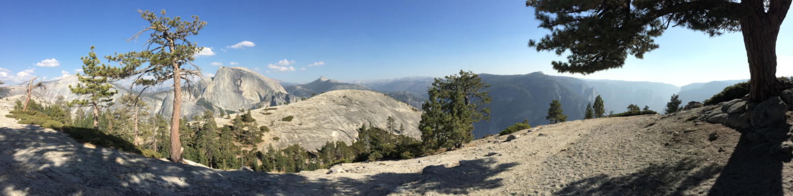
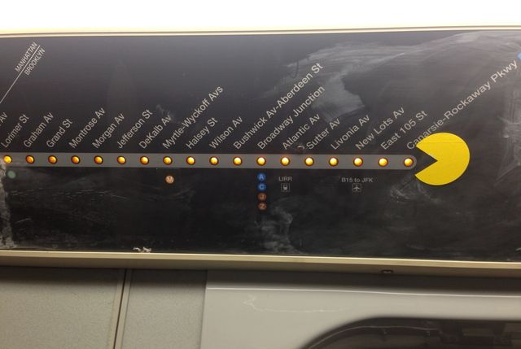

# Park Alert

## Mission Statement
The purpose of this website is to provide information to park enthusiasts that is not readily available on the already exisiting nps.gov website. The drop down menu allows users to select a specific national park for which they can get more detailed information:

##Origins
With outdoor activities such as camping and back-packing gaining in popularity, it has become increasingly difficult to obtain access permits to federal parks. On average, reservations to popular wilderness zones often need to be made six months in advance. However, unpredictable natural disasters such as fires and mudslides that cause park closures can compromise even the most well-planned trips. Not knowing when the park will re-open is an additional obstacle to planning the perfect outdoor adventure.

The original intent of this website was to provide the public with information about parks’ statuses. Not only would a user be able to search for current park closures and openings, but also sort through data to easily store, track, and retrieve information specific to their selected parks and assist with their planning. Since then more content has been added to enhance the user experience.

  
*Future additions: compare userList to closureList to find !== matches and create a new list to show which parks have opened most recently*

 

## Website

### <a href="https://parkintel.herokuapp.com/home">Park Alert System</a>

## 3rd Party API Sources:

**National Parks Services** 
https://developer.nps.gov/api/v1/alerts 
https://developer.nps.gov/api/v1/parks

**Google Map React** 
https://maps.googleapis.com/maps/api/js

**Virtual Sky** 
https://virtualsky.lco.global/embed/index.html

## Technologies
<ul>
<li>React</li>
<li>Express</li>
<li>NodeJS</li>
<li>Mongoose</li>
<li>Javascript</li>
<li>CSS</li>
<li>HTML</li>
<li>Photoshop</li>
</ul>
  

### A Special Thanks to Pacman

